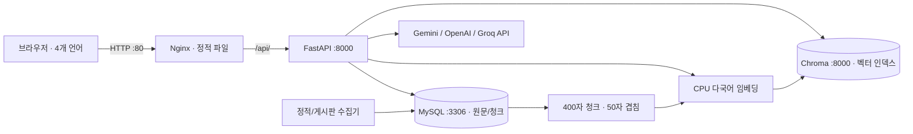

# DOUNER-RAG-ver2

# 동아대학교 학사·공지 안내 — donga-rag-v2

학생 및 유학생의 질문에 관련 학교 문서를 검색하고, 문서에 근거한 답변과 원문 링크를 제공하는 졸업프로젝트 MVP입니다. 기존 `douner_project`와 독립된 프로젝트입니다. HTML/CSS/Vanilla JS, FastAPI, MySQL 8.0, ChromaDB, CPU sentence-transformers를 사용합니다.

**먼저 알아둘 점:** 실제 데이터는 수집 후 색인해야 합니다. 가상 공지나 임의의 졸업요건을 기본 데이터로 넣지 않았습니다. LLM API 키가 없어도 색인이 준비되면 관련 문서 목록을 반환합니다. API 키·VM·학교 사이트 상태에 따라 실서비스 검증은 별도로 필요합니다. `TESTING.md`에 이번 환경의 검증 결과를 기록합니다.

## 1. 전체 아키텍처



외부 공개 포트는 `web:80`뿐입니다. app/db/vector-db는 포트를 호스트에 publish하지 않습니다. Compose 기본 네트워크 안에서 서비스 이름으로 통신합니다. `expose`는 문서화 역할이며 방화벽 자체가 아닙니다. 수집과 외부 API 호출을 위해 app에는 외부 HTTPS 통신이 필요합니다.

## 2. 폴더 구성

```text
donga-rag-v2/
├── app/
│   ├── __init__.py, config.py, crawl_common.py
│   ├── main.py, rag_service.py, llm_provider.py, db.py
│   ├── crawler.py, static_page_crawler.py
│   ├── ingest_notices_to_context.py, ingest_context_to_chroma.py
│   ├── reset_chroma.py, requirements.txt, Dockerfile, .dockerignore
├── html/index.html, chat.html, style.css, app.js
├── data/mysql_data/, vector_data/
├── tests/test_pipeline.py, requirements.txt
├── docker-compose.yml, nginx.conf, .env.example, .gitignore
├── README.md
└── TESTING.md
```

추가 파일은 공통 정제·설정 및 회귀 테스트용입니다. Python 스크립트는 프로젝트 루트에서 `python -m app.모듈명`으로 실행합니다.

## 3. RAG 파이프라인과 데이터 일관성

1. 고정 페이지는 코드에 지정된 제목·카테고리로 저장합니다. 게시판은 목록에서 상세 URL을 얻고 `.bdViewTit .viewTit`과 `#boardContents`를 분리 추출합니다.
2. `clean_text()`가 메뉴·script·style·공유 도구 등을 제거합니다. 표는 행과 셀 구분을 유지한 텍스트로 저장합니다. 이미지/OCR·PDF/HWP 첨부파일은 이번 MVP 범위에 없습니다.
3. URL의 SHA-256 `url_hash`를 UNIQUE로 두고, 본문과 주요 metadata를 포함한 `content_hash`로 변경 여부를 판정합니다. 같은 URL+같은 내용은 새 행을 만들지 않습니다. 다른 URL의 동일 본문은 출처를 보존하기 위해 별도 문서로 둡니다.
4. 수정 문서의 청크만 문서별 MySQL transaction으로 교체합니다. 변경 없는 문서는 청크 ID도 유지합니다. `document_hash`를 통해 제목·카테고리·게시일 변경도 색인에 반영합니다.
5. Chroma는 청크 ID를 vector ID로 사용합니다. metadata가 동일한 벡터는 embedding을 생략하고, 새 벡터를 upsert한 뒤 삭제된 청크의 벡터를 정리합니다. 실패 후 `/ingest`를 재실행하면 이어서 복구합니다.
6. 질문과 문서 모두 같은 모델·revision·정규화 방식을 사용합니다. 기본 검색 개수는 5개 청크입니다. stale 청크와 낮은 관련도를 제거하기 위해 후보는 최대 4배 검색합니다. 따라서 출처 문서 수는 5보다 적을 수 있습니다.
7. 검색 결과는 **MySQL의 현재 문서/청크 hash와 다시 대조**합니다. 문서가 수정되고 재색인 전이면 예전 벡터가 일치하더라도 답변 근거에서 제외합니다.
8. cosine distance `MAX_DISTANCE=0.65` 이하만 사용합니다. distance는 낮을수록 유사하며 확률/정답률이 아닙니다. 이 수치는 초기 설정이며 한국어·일본어·영어·중국어 검증 질문으로 조정해야 합니다.
9. LLM에 현재 날짜, 질문, 출처 번호, 청크만 전달합니다. 문서 내부 지시 무시, 정보 부족 인정, 기간/입학연도 구분, `[1]` 형식 인용을 요구합니다. 인용이 없거나 존재하지 않는 번호면 fallback합니다. **인용 번호 검사는 사실 검증을 대체하지 않으며 hallucination을 완전히 막는다는 보장은 없습니다.**
10. LLM 실패 시 다음 문구와 `sources`를 반환합니다: “AI 답변 생성 중 오류가 발생했습니다. 대신 관련 문서 검색 결과를 표시합니다.” 검색 결과 자체가 없으면 “관련 문서를 찾지 못했습니다.”를 반환합니다.

`retrieve(question, n_results, filters)`에 Chroma `where` metadata 조건을 넘길 수 있습니다. 공개 요청 schema는 요구한 `question`, `language`만 유지합니다. “최근” 질문은 현재 semantic 검색이므로 전체 공지의 시간순 최신 목록을 보장하지 않습니다. 수집 페이지 제한도 있습니다. 향후 category/날짜 필터 및 최신순 검색을 분리할 계획입니다.

## 4. DB 설계

앱 시작 시 `Base.metadata.create_all()`로 다음 테이블을 초기화합니다. 기존 테이블의 schema 변경 migration 기능은 아니므로 운영에서 schema를 바꿀 때는 Alembic을 추가해야 합니다.

| 테이블 | 주요 필드 / 역할 |
|---|---|
| users | id, name, email(UNIQUE), password_hash, provider, created_at |
| chat_history | id, user_id(NULL 허용 FK), question, answer, language, created_at |
| notices | id, source, category, title, content(LONGTEXT), url, published_at, crawled_at, content_hash |
| context_chunks | id, source_type, source_id(FK), category, title, chunk_text, chunk_index, url, content_hash, created_at |
| crawl_logs | id, source, status, message, created_at |

일관성을 위해 `notices.source_type`, `notices.url_hash`, `context_chunks.published_at`, `context_chunks.document_hash`를 추가했습니다. 청크에는 `(source_type, source_id, chunk_index)` UNIQUE 제약이 있습니다. MySQL은 utf8mb4, 내부 수집 시각은 UTC입니다. 학교에 날짜만 표시된 게시일은 날짜를 그대로 보존하며 시간/시간대를 추정하지 않습니다. 고정 페이지 게시일은 NULL입니다.

로그인 UI와 인증 기능은 미구현입니다. users는 향후 확장용 schema입니다. 대화 저장은 기본 꺼져 있으며 `SAVE_CHAT_HISTORY=true`로 켜면 익명 `user_id=NULL`로 저장합니다. 개인정보 보관 정책이 정해지기 전에는 기본값을 유지하세요.

## 5. 실행 환경과 의존성

Docker Engine + Compose v2가 설치된 **Ubuntu x86_64** 서버를 기준으로 합니다. 컨테이너 Python은 3.11이며, 개발 PC Python 3.13이나 ARM용 설치와 혼용하지 마세요.

CPU 조합: `torch 2.6.0+cpu / transformers 4.51.3 / sentence-transformers 4.1.0 / numpy 1.26.4`. Chroma 서버/클라이언트는 `1.0.20`으로 맞춥니다. 최신 버전을 무조건 섞는 대신 호환 기준 버전을 고정했습니다. Docker build가 `pip check`를 실행합니다. 모든 전이 의존성을 hash lock한 것은 아니므로 운영 전 전체 lockfile과 보안 업데이트 검증을 추가하세요.

기본 모델은 `paraphrase-multilingual-MiniLM-L12-v2`입니다. 임베딩은 384차원이며 여러 언어의 의미 비교를 지원합니다. [모델 카드](https://huggingface.co/sentence-transformers/paraphrase-multilingual-MiniLM-L12-v2)를 참조하세요. 다운로드 가능한 revision을 고정하고 HF 캐시를 named volume에 저장합니다. 기본 모델의 128 token 창을 코드에서 256으로 늘렸습니다. **400자는 토큰 수와 다르므로 일부 문장은 여전히 잘릴 수 있고, 이 설정의 검색 품질은 평가가 필요합니다.** 원문 청크는 잘리지 않은 400자를 유지합니다. 장기적으로 tokenizer 기반 분할로 개선하세요.

저사양 대응은 CPU 전용, Uvicorn 1 worker, 임베딩 batch 8, Torch thread 1, MySQL buffer pool 128MB입니다. **1GB급 무료 VM에서 이 4개 서비스를 안정적으로 동시에 구동할 수 있다고 보장하지 않습니다.** 발표용 시작 사양으로 RAM 4GB 이상과 20GB 이상의 여유 디스크를 권합니다. 이는 측정 결과가 아닌 초기 용량 계획입니다. 최초 build/모델 다운로드는 시간이 걸리므로 발표 직전에 시작하지 마세요. 예산·무료 적용 여부는 [GCP 무료 사용 범위](https://cloud.google.com/free/docs/free-cloud-features#compute)를 직접 확인하세요.

## 6. .env 설정과 Docker 실행

프로젝트 루트에서 Ubuntu Bash로 실행합니다.

```bash
cp .env.example .env
chmod 600 .env
nano .env
```

다음 값을 직접 설정하세요. 저장소에는 실제 키나 비밀번호가 들어 있지 않습니다.

| 변수 | 설정 |
|---|---|
| MYSQL_PASSWORD | donga 애플리케이션 계정의 강한 비밀번호 |
| MYSQL_ROOT_PASSWORD | 다른 강한 관리자 비밀번호 |
| ADMIN_API_KEY | 수집·색인·debug API용 긴 임의 토큰 |
| LLM_PROVIDER | gemini (기본), openai, groq |
| GEMINI_API_KEY | 기본 답변 생성용 키. 비워 두면 검색 결과 fallback |
| OPENAI_API_KEY / GROQ_API_KEY | 해당 provider를 사용할 때만 필요 |
| GEMINI_MODEL / OPENAI_MODEL / GROQ_MODEL | 사용 계정에서 접근 가능한 모델 ID |

토큰은 `openssl rand -hex 32`로 생성할 수 있습니다. Compose의 `$` 보간 문제를 피하려면 비밀번호도 충분히 긴 hex 문자열을 사용하는 방법이 간단합니다. `.env`를 JS/HTML에 복사하지 마세요.

```bash
docker compose config --quiet
docker compose up -d --build
docker compose ps
docker compose logs --tail=100 app web
curl -sS http://localhost/api/v1/heartbeat
```

브라우저에서 `http://서버-IP/` 또는 `/chat.html`을 엽니다. `.env`를 변경한 뒤에는 `docker compose up -d --force-recreate app`이 필요합니다. 단순 restart는 새 환경변수를 반영하지 않습니다. 기존 MySQL 데이터가 있으면 비밀번호 환경변수 변경만으로 DB 계정 비밀번호가 바뀌지 않습니다.

`heartbeat`는 liveness를 위해 HTTP 200을 반환하고 JSON에 dependency 상태를 담습니다. `status=degraded`, `index=empty`는 최초 ingest 전 정상적으로 나타날 수 있습니다. LLM quota나 키의 유효성은 heartbeat에서 API를 호출해 검사하지 않습니다.

## 7. 수집 → 색인

HTTP 호출을 위해 토큰을 쉘에 입력합니다. `.env`를 `source`할 필요는 없습니다.

```bash
read -rsp 'ADMIN_API_KEY: ' ADMIN_API_KEY; echo
export ADMIN_API_KEY
curl -sS -X POST http://localhost/api/v1/crawl/static \
  -H "X-Admin-Key: $ADMIN_API_KEY"
curl -sS -X POST http://localhost/api/v1/crawl/notices \
  -H "X-Admin-Key: $ADMIN_API_KEY"
curl -sS -X POST http://localhost/api/v1/ingest \
  -H "X-Admin-Key: $ADMIN_API_KEY"
```

첫 모델 다운로드나 게시판 수집이 proxy timeout보다 길어질 수 있으므로 **최초 준비는 CLI 실행을 권장**합니다. API가 timeout되어도 서버 작업이 즉시 취소된다고 가정하지 말고 로그를 확인하세요.

```bash
docker compose exec app python -m app.static_page_crawler
docker compose exec app python -m app.crawler
docker compose exec app python -m app.ingest_notices_to_context
docker compose exec app python -m app.ingest_context_to_chroma
```

MySQL advisory lock으로 HTTP/CLI 수집·색인 작업을 직렬화합니다. 작업 중 또 실행하면 HTTP 409를 반환합니다. 기본 수집 범위는 게시판당 1페이지에서 게시일 순 10건입니다. `CRAWL_PAGES`(최대 10), `CRAWL_MAX_NOTICES`(최대 100)로 변경합니다. 고정 공지가 최신 공지를 모두 밀어내지 않도록 수집 목록을 날짜순으로 정렬합니다. 요청 간 최소 0.5초(기본 1초) 간격을 두며 robots.txt가 금지하면 실패 로그를 남깁니다. robots.txt 응답 오류도 안전하게 실패 처리합니다. 실제 대학 운영 정책과 수집 협의는 별도로 확인하세요.

### 수집 주소 변경 사항

2026-09-14 실제 [학교 학사안내 페이지의 메뉴](https://www.donga.ac.kr/kor/CMS/Contents/Contents.do?mCode=MN137)에서 아래 주소를 확인했습니다. 요청의 기존 게시판 URL은 현재 메뉴와 달라 수정했습니다.

| 자료 | 요청의 mCode | 구현의 mCode |
|---|---|---|
| 일반공지 | MN122 | MN170 |
| 학사공지 | MN123 | MN171 |
| 장학공지 | MN124 | MN172 |
| 졸업기준 / 조기졸업 | MN137 / MN140 | 동일 |
| 국제교류처 / 컴퓨터공학과 | MN066 / MN044 | 동일 |

`.contents_view_wrap` 또는 게시판 본문을 찾지 못하면 전체 페이지를 대신 저장하지 않습니다. 수집 오류는 `crawl_logs`에 남기고 다음 문서를 계속 처리합니다. DB 자체가 중단되어 로그 저장도 불가능하면 컨테이너 로그에 `crawl_log_write_failed`를 남깁니다. 사라진 공지를 자동 삭제하지 않으며 성공적으로 수집된 변경만 갱신합니다.

## 8. API 확인

```bash
curl -sS http://localhost/api/v1/heartbeat
curl -sS http://localhost/api/v1/debug/sources -H "X-Admin-Key: $ADMIN_API_KEY"
curl -sS http://localhost/api/v1/debug/chunks -H "X-Admin-Key: $ADMIN_API_KEY"
curl -sS http://localhost/api/v1/ask -H 'Content-Type: application/json' \
  -d '{"question":"조기졸업 조건 알려줘","language":"ko"}'
curl -sS http://localhost/api/v1/ask -H 'Content-Type: application/json' \
  -d '{"question":"日本語で留学生向けのお知らせを教えてください","language":"ja"}'
curl -sS http://localhost/api/v1/ask -H 'Content-Type: application/json' \
  -d '{"question":"Please summarize the graduation requirements","language":"en"}'
curl -sS http://localhost/api/v1/ask -H 'Content-Type: application/json' \
  -d '{"question":"请告诉我留学生相关通知","language":"zh"}'
```

응답은 `answer`, `sources`, `debug_info`입니다. 출처에는 id/title/category/url/published_at/source_type/source_id를 담습니다. `debug_info.distances`에는 청크별 거리와 채택 여부를 기록합니다. `status`는 ok/no_results/llm_fallback/retrieval_unavailable 중 하나입니다. LLM 키·서버 stack trace·upstream 응답 본문은 노출하지 않습니다. 질문은 최대 2,000자입니다. Nginx API 요청 제한은 IP당 분당 10회(+burst), 앱 질문 동시 처리 상한은 2개입니다.

## 9. 발표 시연 순서

1. 전날 Docker build, 수집, 색인, 질문 1회를 완료해 모델 캐시를 준비합니다.
2. `heartbeat`와 `debug/sources`, `debug/chunks`로 저장 자료를 확인합니다.
3. “졸업하려면 어떤 조건을 확인해야 해?” → 답변 번호와 원문 링크를 보여줍니다.
4. “조기졸업 조건 알려줘” → 일반 졸업요건과 조건 차이를 원문으로 확인합니다.
5. “유학생 관련 최근 공지 알려줘”, “장학금 신청 공지 알려줘”, “컴퓨터공학과 최근 공지 알려줘”를 시연합니다. 현재 수집 범위라는 한계를 함께 설명합니다.
6. 일본어/영어/중국어 언어 버튼을 선택하고 위 예시 질문을 입력합니다. 자동평가와 별개로 실제 언어 품질을 사전 확인하세요.
7. 관련 없는 질문으로 검색 결과 없음 처리를 보여줍니다. 임계값에 따라 무관 문서가 나오는지 미리 평가합니다.
8. Gemini 키를 일시적으로 비우고 app을 recreate하여 `missing_api_key` fallback과 원문 목록이 남는 것을 보여줍니다. 실제 quota를 일부러 소진할 필요는 없습니다.
9. 키를 복구하고 재생성합니다. `.env`나 키가 터미널/녹화 화면에 보이지 않도록 합니다.

모델 API 지원은 환경변수로 선택하며 자동으로 다른 유료 provider로 요청을 보내지 않습니다. [Gemini generateContent](https://ai.google.dev/gemini-api/docs/text-generation), [OpenAI Chat Completions](https://developers.openai.com/api/reference/resources/chat/subresources/completions/methods/create), [Groq 호환 API](https://console.groq.com/docs/openai)를 사용합니다. 모델 가용성과 quota는 계정에 따라 실제 호출로 확인해야 합니다.

## 10. 장애 대응과 운영

| 증상 | 확인 / 조치 |
|---|---|
| Nginx 502 | `docker compose logs --tail=100 web app`, `docker compose ps`; app 시작·DB 인증·OOM 확인 |
| DB connection 실패 | `.env` 계정/암호, db healthcheck, 기존 볼륨의 계정 확인 |
| 스킵네비게이션 제목 | 정적 수집기를 사용했는지 확인. 게시판 제목 선택자와 `crawl_logs` 확인 |
| 공지 수집 0건 | 현재 mCode, robots.txt, `td.subject`/`#boardContents` 변경, 이미지 전용 게시물 확인 |
| quota / key / timeout | sources를 이용하고 `debug_info.error_code` 확인. provider/key/model 변경 후 app recreate |
| 빈 sources | 수집 → chunk → vector 순서, distance threshold, 최신 hash 일치 여부 확인 |
| embedding_model_mismatch | 모델/리비전/window가 바뀜. 아래 reset 후 재색인 |
| 최초 ingest 지연 | HF 모델 다운로드 및 CPU 처리 대기. CLI 사용, 로그 확인 |
| 409 | 다른 수집/색인 작업 종료 후 재실행 |
| 429 | rate limit 또는 동시 질문 상한. 잠시 후 재시도 |
| HTTP 504 | 최초 작업이 오래 걸리는지 app 로그 확인. 반복 실행하지 말고 종료 후 CLI로 재시도 |

Chroma만 재구축:

```bash
docker compose exec app python -m app.reset_chroma --yes
```

MySQL context_chunks를 기준으로 collection 하나만 지우고 다시 만듭니다. 재구축 중 검색은 일시적으로 비거나 부분 결과를 반환할 수 있으므로 발표 전에 끝내세요. 전체 무중단 인덱스 교체는 향후 개선 항목입니다. [Chroma Docker 저장 경로](https://docs.trychroma.com/guides/deploy/docker)에 맞춰 `./data/vector_data:/data`를 사용합니다.

```bash
docker compose logs -f --tail=100 app web
docker compose stats --no-stream
docker compose exec db sh -c 'MYSQL_PWD="$MYSQL_PASSWORD" mysql -u"$MYSQL_USER" "$MYSQL_DATABASE" -e "SELECT source,status,message,created_at FROM crawl_logs ORDER BY id DESC LIMIT 20"'
docker compose stop
docker compose start
```

MySQL 원문/metadata가 복구의 기준입니다. 운영에서는 `mysqldump --single-transaction` 논리 백업과 복원 검증을 마련하세요. 실행 중인 `mysql_data` 디렉터리를 단순 복사한 것만으로 일관된 백업이라고 가정하지 마세요. Chroma는 재생성 가능하므로 원문 백업을 우선합니다. 큰 corpus에서는 현재 ID set 메모리 사용과 metadata 조회를 개선해야 합니다.

GCP 배포 시 Ubuntu VM에 이 폴더를 업로드하고 Docker Compose를 실행합니다. VM 방화벽에는 HTTP 80만 열고 SSH는 관리 IP 또는 IAP로 제한합니다. MySQL/FastAPI/Chroma 포트를 인터넷에 추가 개방하지 마세요. **현재 Compose는 요청한 HTTP 시연용 구성입니다.** 공개 운영에서는 도메인·TLS와 HTTPS를 추가하고 관리자 토큰을 평문 HTTP로 인터넷에 보내지 마세요. 관리 작업은 SSH 안에서 `localhost` curl 또는 위 CLI를 실행하면 됩니다. 앱은 로그인 없는 공개 질문 API이므로 실제 운영 전 사용자별 quota·비용 한도도 필요합니다.

## 11. 테스트

```bash
# 빌드 시 의존성 검사와 별도로, 격리된 일회용 컨테이너에서 회귀 테스트
docker compose run --rm --no-deps --user root \
  -v "$PWD/tests:/service/tests:ro" \
  app sh -c 'pip install pytest==8.3.5 && pytest -q /service/tests -p no:cacheprovider'

docker compose exec app pip check
docker compose exec web nginx -t
```

테스트는 SQLite와 외부 API/vector test doubles를 사용합니다. 실제 MySQL SQL dialect, 네트워크 Chroma, 임베딩 품질, 실제 LLM 호출을 대체하지 않습니다. 실제 integration 검증은 위 수집·색인·ask 순서를 Docker에서 실행해야 합니다.

## 12. 발표 예상 질문

**1. GPT 자체가 RAG인가?**  
아닙니다. GPT는 생성 모델이고, RAG는 질문에 관련된 외부 자료를 검색해 모델 입력에 넣는 시스템 구성입니다. 이 서비스는 Gemini도 같은 RAG 흐름에 연결합니다.

**2. 벡터 변환으로 어떻게 비슷한 공지를 찾는가?**  
질문과 청크를 같은 embedding 모델로 숫자 배열로 바꾸고 cosine distance로 의미가 가까운 항목을 찾습니다. 단어가 정확히 같지 않아도 찾을 수 있지만 유사도가 정답을 보장하지는 않습니다.

**3. chunk_size 400의 의미는 무엇인가?**  
Python 문자열 기준 최대 400자입니다. 토큰/바이트 400개가 아닙니다. 50자를 겹쳐 경계에서 문맥이 끊기는 문제를 줄입니다. 표·조건문이 분리될 수 있어 문서 구조 기반 분할이 후속 과제입니다.

**4. 자료가 많아지면 DB와 용량을 어떻게 관리하는가?**  
변경분만 수집·embedding하고 source/category/게시일 인덱스로 조회합니다. 원문, 청크, 벡터와 로그 용량을 각각 모니터링하며 첨부파일은 object storage로 분리할 수 있습니다. 384차원 float32 raw vector는 약 1.5KB이지만 실제 저장량에는 index와 metadata 오버헤드가 추가됩니다.

**5. 오래된 자료는 삭제할 것인가?**  
일괄 삭제하지 않습니다. 졸업규정은 입학연도에 따라 과거 자료도 필요합니다. 기간 종료 공지는 보존하되 검색 필터와 상태 표시로 구분하고 학교 정책에 따라 보관 기간을 정합니다. 현재 MVP는 자동 삭제하지 않습니다.

**6. MySQL과 ChromaDB를 왜 같이 쓰는가?**  
MySQL은 원문·출처·변경 이력의 기준 데이터와 관계형 제약을 관리합니다. Chroma는 의미 검색용 인덱스입니다. 벡터가 손상돼도 MySQL 청크로 다시 생성할 수 있습니다.

**7. LLM이 틀린 답변을 하면 어떻게 할 것인가?**  
출처와 게시일을 표시하고 근거 없는 답변을 거부하도록 prompt와 인용 검사를 적용합니다. 하지만 이것만으로 사실성을 보장할 수 없어 입학연도/마감일 검증 질문셋과 담당자 검토, 사용자 오류 신고가 필요합니다. 원문 확인을 최종 판단 기준으로 둡니다.

**8. Graph RAG를 사용하면 신뢰성이 올라가는가?**  
학과–입학연도–교육과정–졸업요건 같은 관계를 탐색하는 데 도움이 될 수 있습니다. 관계 추출이 틀리거나 자료가 오래되면 오히려 오류를 늘릴 수도 있습니다. 우선 수집 품질·metadata·검색 평가를 개선하고 필요성이 확인되면 도입합니다.

**9. 로그인 필요한 LMS/포털 페이지는 어떻게 수집할 것인가?**  
현재 수집하지 않습니다. 학교 승인과 공식 API/내보내기를 우선하며, 도입 시 사용자별 접근 권한을 검색에도 적용하고 토큰·개인정보·보관 기간을 관리해야 합니다. 인증 우회나 공용 계정 무단 수집을 하지 않습니다.

**10. Docker 컨테이너는 어떻게 역할별로 관리하는가?**  
web은 정적 제공/프록시, app은 RAG/API, db는 기준 데이터, vector-db는 벡터 검색입니다. 서비스별 로그·healthcheck·restart 정책을 사용하고 데이터는 볼륨에 둡니다. app만 재배포해도 DB 데이터는 유지됩니다.

## 13. 향후 개선

- 날짜/category/학과/입학연도 필터, 최신순 공지 API, keyword+vector hybrid retrieval, reranker
- 표와 제목 구조를 살린 token 기반 청킹, 첨부파일 파싱·OCR, 근거 문장별 검증
- 언어별 질문셋의 Recall@5·인용 정확도·응답 지연 평가와 threshold 보정
- background job queue와 진행률 API, 재시도 정책, 무중단 인덱스 교체
- Alembic migration, 전체 dependency lock, CI의 실제 MySQL/Chroma integration test
- 관리자 UI, 인증·권한, TLS, 비용 한도, 모니터링과 백업 복원 훈련

이 프로젝트는 학교의 공식 상담을 대신하지 않습니다. 학사 판단에 필요한 개인별 조건은 원문과 담당 부서에서 확인합니다.
